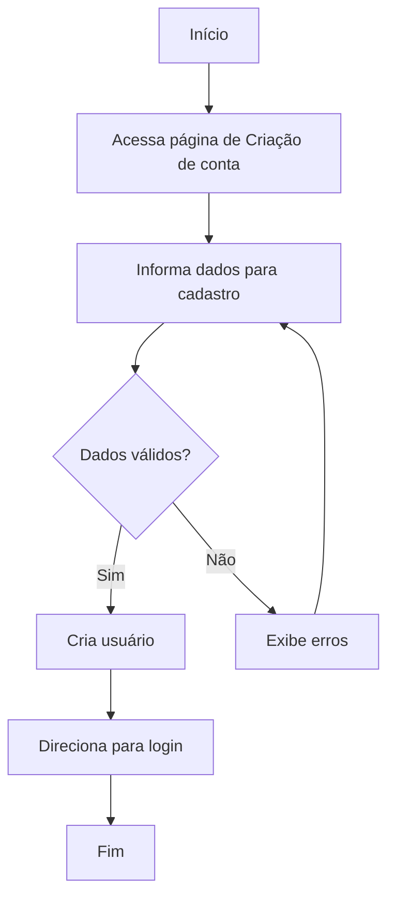

# UC-003 — Criar conta

> User Flow referente ao caso de uso de criação de conta no aplicativo.

## 1. Visão geral

### Objetivo

Permitir que um usuário crie sua conta para utilizar o aplicativo.

### Ator

**Principal:** Usuário

### Pré-condições

* O sistema deve estar disponível.

### Pós-condições

**Sucesso:**

* O usuário possui uma conta criada.
* O usuário é direcionado para a tela de login do sistema.

**Falha:**

* O usuário permanece na página de criação de conta.

---

# 2. User Flow


---

# 3. Fluxo principal

### Step 1 — Acessar Cadastro de usuário

O usuário acessa a página de cadastro através do link "Criar Conta" da tela de Login.

---

### Step 2 — Informar dados

O usuário informa:

* Nome.
* E-mail.
* Senha.

O usuário seleciona **Criar Conta**.

---

### Step 3 — Validar dados

O sistema valida os dados informados.

#### Validações

* O nome é obrigatório.
* E-mail é obrigatório.
* E-mail deve possuir formato válido.
* O E-mail não pode ter sido cadastrado em outra conta.
* Senha é obrigatória.
* A senha deve respeitar os critérios pré definidos.

Caso os dados sejam inválidos, o fluxo segue para **FA-001 — Dados inválidos**.

---

### Step 4 — Criar usuário

O sistema envia os dados informados para a criação do usuário.

O sistema verifica:

1. Se os dados foram informados.
2. Se o e-mail informado já existe.
3. Se a senha atende aos critérios necessários.

---

### Step 5 — Redirecionar usuário

O sistema direciona o usuário para a página de login.

**Destino padrão:**

```text
/login
```

O fluxo é concluído.

---

# 4. Fluxos alternativos

## FA-001 — Dados inválidos

**Origem:** Step 3

1. O sistema identifica um ou mais campos inválidos.
2. O sistema apresenta o erro junto ao campo correspondente.
3. O usuário corrige os dados.
4. O usuário tenta realizar o login novamente.
5. O fluxo retorna ao Step 3.

---

# 5. Exceções

## EX-001 — Serviço de criação indisponível

Caso o serviço necessário para criação do usuário esteja indisponível:

1. O sistema não conclui a criação do usuário.
2. O sistema informa que não foi possível realizar a criação naquele momento.
3. O usuário permanece na página de cadastro.

---

## EX-002 — Erro inesperado

Caso ocorra um erro não previsto:

1. O sistema deverá seguir as regras descritas no arquivo [Erro Inesperado](../../exceptions/erro-inesperado.md).

---

# 6. Estados

O fluxo de cadastro possui os seguintes estados principais:

```text
Sem cadastro
       │
       ▼
Preenchendo informações
       │
       ▼
Validando
   ┌───┴────┐
   │        │
 inválido  válido
   │        │
   ▼        ▼
 Erro    Usuário criado
            │
            ▼
        Tela de Login
```

---

# 7. Critérios de aceite

### Cadastro com sucesso

- [ ] Usuário consegue informar os dados para cadastro.
- [ ] Sistema valida os dados informados.
- [ ] Sistema cria um usuário.
- [ ] Usuário é direcionado para `/login`.

### Validação

- [ ] Nome vazio é rejeitado.
- [ ] E-mail vazio é rejeitado.
- [ ] E-mail em formato inválido é rejeitado.
- [ ] Senha vazia é rejeitada.
- [ ] Senha fora dos critérios estabelecidos é rejeitada.
- [ ] Mensagens de validação são apresentadas de forma clara.

### Dados inválidos

- [ ] Sistema rejeita dados inválidas.
- [ ] Sistema informa quais dados estão incorretos.
- [ ] Usuário não é criado.

### Falhas

- [ ] Indisponibilidade do serviço é tratada.
- [ ] Erros inesperados são tratados.
- [ ] O usuário pode tentar novamente após uma falha.

---

# 8. Referências

### Casos de uso relacionados

* `UC-003 — Login`

### Interfaces relacionadas
* [UI-001 - Criar conta](../../ui/UI-003-criar-usuario.md)

### Regras de negócio relacionadas
* [BR-001 - Criar conta](../../business-rules/criacao-usuario.md)

---
