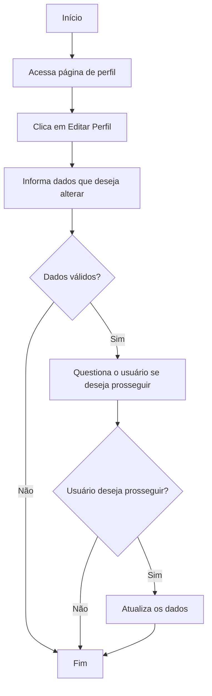

# UC-001 — Gerenciar Perfil

> User Flow referente ao caso de uso de gerenciamento de perfil pelo usuário logado.

## 1. Visão geral

### Objetivo

Permitir que um usuário altere suas informações de perfil, editando seus dados na plataforma.

### Ator

**Principal:** Usuário

### Pré-condições

* O usuário deve possuir uma conta cadastrada.
* O sistema deve estar disponível.

### Pós-condições

**Sucesso:**

* O perfil do usuário estará atualizado.
* O usuário permanecerá na página para atualizar seu perfil.

**Falha:**

* Nenhum dado do usuário será alterado.

---

# 2. User Flow


---

# 3. Fluxo principal

### Step 1 — Acessar Perfil

O usuário acessa a página de perfil e visualiza seus dados.

---

### Step 2 - Editar informações

O usuário clica no link **editar perfil** e uma nova tela, com os campos
disponíveis para atualização é exibida.

### Step 3 — Informar dados

O usuário poderá informar:

* Nome.
* Foto.
* E-mail.

O usuário seleciona **Salvar**.

---

### Step 3 — Validar dados

O sistema valida os dados informados.

#### Validações

* Nome deve ser informado.
* E-mail deve possuir formato válido.
* Foto deve estar em png ou jpg com no máximo 400 x 400 pixels, mas não é obrigatória.

Caso os dados sejam inválidos, o fluxo segue para **FA-001 — Dados inválidos**.

---

### Step 4 - Confirmação de atualização

O sistema questionará o usuário se ele realmente deseja atualizar as informações

### Step 5 — Salvar dados

Caso o usuário aceite salvar os dados, o sistema envia as informações para atualizar o usuário.

O sistema somente atualizará os dados que foram informados.

O sistema validará:

1. Se o e-mail está em formato correto.
2. Se o e-mail já não está sendo utilizado por outro usuário.
3. Se a foto está em formato correto (jpg ou png).
4. Se a foto está no tamanho correto (400 x 400 pixels).

---

### Step 6 — Redirecionar usuário

O sistema redirecionará o usuário para a tela de visualização de perfil.

O fluxo é concluído.

---

# 4. Regras de negócio

### RN-001 — E-mail válido

O e-mail deve estar em um formato válido e não estar sendo utilizado por outro usuário na base de dados.

### RN-002 — Alteração de senha

Não deve ser possível alterar a senha por esta funcionalidade. Esta alteração será feita em funcionalidade separada.

### RN-003 - Foto de perfil

Somente deve ser aceito fotos no formato png ou jpg. A foto deve ter no máximo 400 x 400 pixels, aceitando fotos menores.

### RN-004 - Confirmação de atualização

Antes de alterar os dados, deve ser apresentado ao usuário uma mensagem para que ele confirme que deseja realmente
realizar a operação. Se o usuário desistir da atualização, nenhum dado deve ser atualizado.

# 5. Regras de segurança

### RS-001 — Visualização de perfil de outro usuário

Não deve ser possível que um usuário visualize as informações de perfil de outro usuário.

### RS-002 — Alteração de perfil de outro usuário

Não deve ser possível que um usuário altere as informações de perfil de outro usuário.

# 6. Fluxos alternativos

## FA-001 — Dados inválidos

**Origem:** Step 3

1. O sistema identifica um ou mais campos inválidos.
2. O sistema apresenta o erro junto ao campo correspondente.
3. O usuário corrige os dados.
4. O usuário tenta realizar a atualização novamente.

---

## FA-002 — Atualização cancelada

**Origem:** Step 4

Caso o usuário desista de atualizar os dados.

1. O sistema não chama a regra de atualização.
2. O sistema permanece na página de edição do perfil, com os dados que o usuário informou.
3. O usuário pode editar os dados e enviar novamente.

---

# 5. Exceções

## EX-001 — Serviço de atualização indisponível

Caso o serviço necessário para atualização esteja indisponível:

1. O sistema não conclui a atualização.
2. O sistema informa que não foi possível realizar a atualização naquele momento.
3. O usuário permanece na página de edição do perfil.
4. Nenhuma alteração deve ser realizada.

---

## EX-002 — Erro inesperado

Caso ocorra um erro não previsto:

1. O sistema deverá seguir as regras descritas no arquivo [Erro Inesperado](../../exceptions/erro-inesperado.md).


---

# 6. Estados

O fluxo de edição de perfil possui os seguintes estados principais:

```text
Editando perfil
       │
       ▼
Preenchendo os dados de perfil
       │
       ▼
Validando
   ┌───┴────┐
   │        │
 inválido  válido
   │        │
   ▼        ▼
 Erro    Atualizado
            │
            ▼
        Visualizando perfil atualizado
```

---

# 7. Interface do usuário

## Elementos da interface

### Ao abrir a tela de perfil

| Elemento            | Tipo   | Ação                     |
| ------------------- | ------ | ------------------------ |
| Nome                | Label  | Exibir o nome cadastrado |
| E-mail              | Label  | Exibir o e-mail cadastrado |
| Foto                | Elemento visual  | Exibir a foto do perfil |
| Editar perfil       | Link  | Abrir a edição de perfil do usuário |

### Ao clicar em editar perfil

| Elemento            | Tipo   | Obrigatório | Ação                 |
| ------------------- | ------ | ----------: | -------------------- |
| Nome                | Input  |         Sim | Informar nome        |
| E-mail              | Input  |         Sim | Informar e-mail      |
| Foto                | Input  |         Não | Informar o caminho da foto |
| Buscar foto         | Button |           — | Buscar a imagem no sistema |
| Salvar              | Button |           — | Iniciar atualizações  |
| Cancelar            | Button |           — | Cancelar atualizações |

## Estados da interface

### Ao abrir a tela de perfil

#### Estado inicial

- Dados cadastrados sendo exibidos, sem conseguir alterar.
- Link "Editar Perfil" disponível.

### Ao abrir a tela de edição de perfil

#### Estado inicial

- Campos preenchidos com os dados cadastrados atualmente.
- Botões Buscar foto, Salvar e Cancelar habilitados.

#### Preenchimento

- Nome e e-mail apresentam os dados informados pelo usuário.
- Campo da foto apresenta o caminho da foto no servidor.
- Botão Buscar Foto abre a busca de arquivos do sistema.

### Validação

Quando houver erro de validação:

- O campo inválido deve ser destacado.
- Uma mensagem de validação deve ser apresentada próxima ao campo.
- O usuário deve poder corrigir o valor.

### Erro de serviço

- Apresentar uma mensagem informando que não foi possível atualizar os dados.
- Permitir que o usuário tente novamente.

## Navegação

| Origem | Ação                      | Destino                   |
|--------|-------------------------- |-------------------------- |
| Editar Perfil  | Confirmar edição  | Visualização de perfil  |
| Editar Perfil  | Cancelar edição   | Visualização de perfil      |

## Responsividade

A interface deve ser utilizável em:

- Desktop
- Tablet
- Mobile

## Acessibilidade

- Todos os campos devem possuir identificação adequada.
- O formulário deve ser navegável pelo teclado.
- Mensagens de erro devem ser associadas aos respectivos campos.
- O foco deve ser visível.
- O botão e os links devem possuir estados de interação acessíveis.

## Fora do escopo

Este documento não define:

- Cores.
- Tipografia.
- Espaçamentos.
- Ícones.
- Layout final.
- Componentes específicos de uma biblioteca de UI.
- Tecnologia utilizada na implementação.

# 8. Critérios de aceite

### Dados atualizados com sucesso

- [ ] Usuário consegue informar os dados para atualizar.
- [ ] Sistema valida os dados enviados.
- [ ] Sistema atualiza o perfil do usuário.
- [ ] Usuário é direcionado para a visualização do seu perfil.

### Validação

- [ ] E-mail vazio é rejeitado.
- [ ] E-mail em formato inválido é rejeitado.
- [ ] Nome vazio é rejeitado.
- [ ] Foto em formato diferente é rejeitada.
- [ ] Foto muito grande é rejeitada.
- [ ] Mensagens de validação são apresentadas de forma clara.

### Falhas

- [ ] Indisponibilidade do serviço é tratada.
- [ ] Erros inesperados são tratados.
- [ ] O usuário pode tentar novamente após uma falha.

---

# 9. Visibilidade da funcionalidade

Esta funcionalidade, assim como suas rotas, estarão disponíveis somente para usuários logados no sistema, não sendo possível acessar de forma externa.
