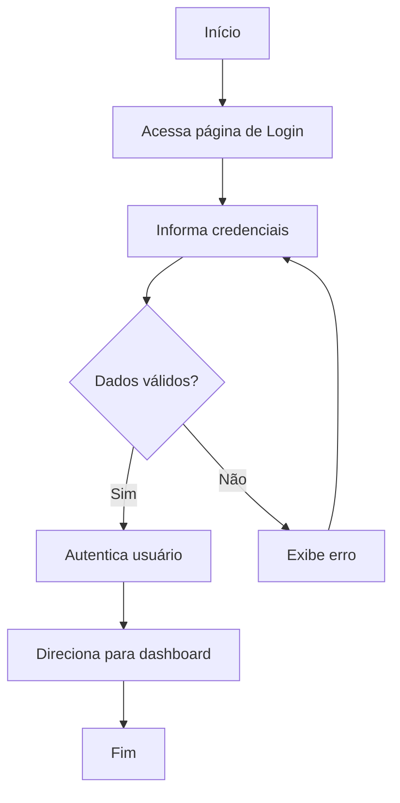

# UC-001 — Login

> User Flow referente ao caso de uso de autenticação de usuários.

## 1. Visão geral

### Objetivo

Permitir que um usuário existente se autentique no sistema para acessar funcionalidades protegidas.

### Ator

**Principal:** Usuário

### Pré-condições

* O usuário deve possuir uma conta cadastrada.
* O sistema deve estar disponível.

### Pós-condições

**Sucesso:**

* O usuário está autenticado.
* O usuário possui uma sessão válida.
* O usuário é direcionado para a área autenticada do sistema.

**Falha:**

* O usuário permanece não autenticado.
* Nenhuma sessão autenticada é criada.

---

# 2. User Flow


---

# 3. Fluxo principal

### Step 1 — Acessar Login

O usuário acessa a página de login.

---

### Step 2 — Informar credenciais

O usuário informa:

* E-mail.
* Senha.

O usuário seleciona **Entrar**.

---

### Step 3 — Validar dados

O sistema valida os dados informados.

#### Validações

* E-mail é obrigatório.
* E-mail deve possuir formato válido.
* Senha é obrigatória.

Caso os dados sejam inválidos, o fluxo segue para **FA-001 — Dados inválidos**.

---

### Step 4 — Autenticar usuário

O sistema envia as credenciais para autenticação.

O sistema verifica:

1. Se o usuário existe.
2. Se a senha está correta.
3. Se a conta pode realizar login.

---

### Step 5 — Criar sessão

Após a autenticação:

1. O sistema cria uma sessão autenticada.
2. Os tokens necessários são gerados.
3. O estado de autenticação do cliente é atualizado.

---

### Step 6 — Redirecionar usuário

O sistema direciona o usuário para a página inicial da área autenticada.

**Destino padrão:**

```text
/dashboard
```

O fluxo é concluído.

---

# 4. Fluxos alternativos

## FA-001 — Dados inválidos

**Origem:** Step 3

1. O sistema identifica um ou mais campos inválidos.
2. O sistema apresenta o erro junto ao campo correspondente.
3. O usuário corrige os dados.
4. O usuário tenta realizar o login novamente.
5. O fluxo retorna ao Step 3.

---

## FA-002 — Credenciais inválidas

**Origem:** Step 4

Caso as credenciais não correspondam a um usuário válido:

1. O sistema rejeita a autenticação.
2. O sistema informa que as credenciais são inválidas.
3. O usuário permanece na página de login.
4. O usuário pode tentar novamente.

> Por segurança, o sistema não deve informar se o e-mail ou a senha especificamente estão incorretos.

---

## FA-003 — Usuário esqueceu a senha

**Origem:** página de login

1. O usuário seleciona **Esqueci minha senha**.
2. O sistema direciona para o fluxo de recuperação de senha.

**Próximo Use Case:**

`UC-004 — Recuperar senha`

---

# 5. Exceções

## EX-001 — Serviço de autenticação indisponível

Caso o serviço necessário para autenticação esteja indisponível:

1. O sistema não conclui a autenticação.
2. O sistema informa que não foi possível realizar o login naquele momento.
3. O usuário permanece na página de login.
4. Nenhuma sessão parcial deve ser criada.

---

## EX-002 — Erro inesperado

Caso ocorra um erro não previsto:

1. O sistema registra o erro para diagnóstico.
2. O sistema apresenta uma mensagem genérica ao usuário.
3. O sistema não expõe informações técnicas ou sensíveis.

---

# 6. Estados

O fluxo de login possui os seguintes estados principais:

```text
Não autenticado
       │
       ▼
Preenchendo credenciais
       │
       ▼
Validando
   ┌───┴────┐
   │        │
 inválido  válido
   │        │
   ▼        ▼
 Erro    Autenticado
            │
            ▼
        Área protegida
```

---

# 7. Critérios de aceite

### Login com sucesso

- [ ] Usuário consegue informar e-mail e senha.
- [ ] Sistema autentica credenciais válidas.
- [ ] Sistema cria uma sessão válida.
- [ ] Usuário é direcionado para `/dashboard`.

### Validação

- [ ] E-mail vazio é rejeitado.
- [ ] E-mail em formato inválido é rejeitado.
- [ ] Senha vazia é rejeitada.
- [ ] Mensagens de validação são apresentadas de forma clara.

### Credenciais inválidas

- [ ] Sistema rejeita credenciais inválidas.
- [ ] Sistema não informa se o e-mail ou senha está incorreto individualmente.
- [ ] Login inválido não cria sessão.

### Falhas

- [ ] Indisponibilidade do serviço é tratada.
- [ ] Erros inesperados são tratados.
- [ ] O usuário pode tentar novamente após uma falha.

---

# 8. Referências

### Casos de uso relacionados

* `UC-003 — Criar conta`
* `UC-004 — Recuperar senha`
* `UC-002 — Logout`

### Interfaces relacionadas
* [UI-001 - Login](../../ui/UI-001-login.md)

### Regras de negócio relacionadas
* [BR-001 - Login](../../business-rules/autenticacao.md)

---
